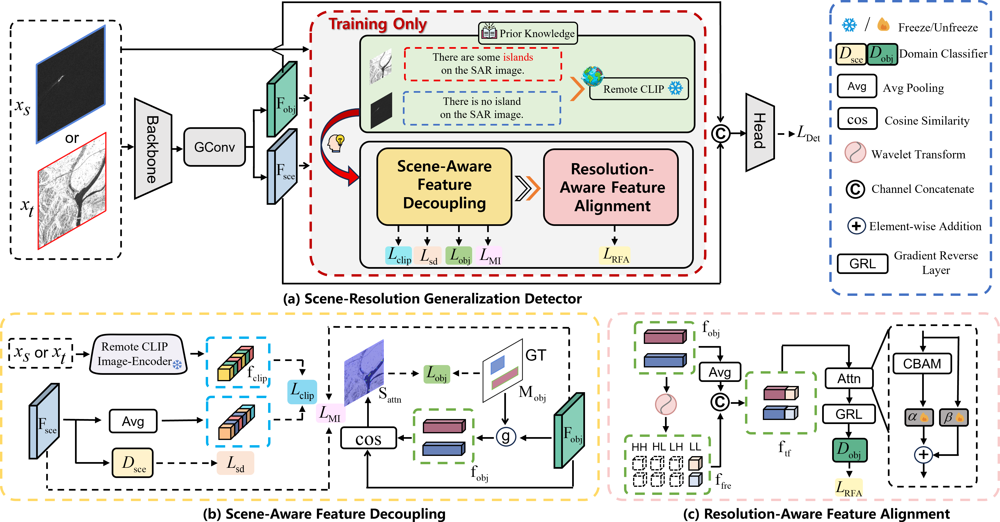
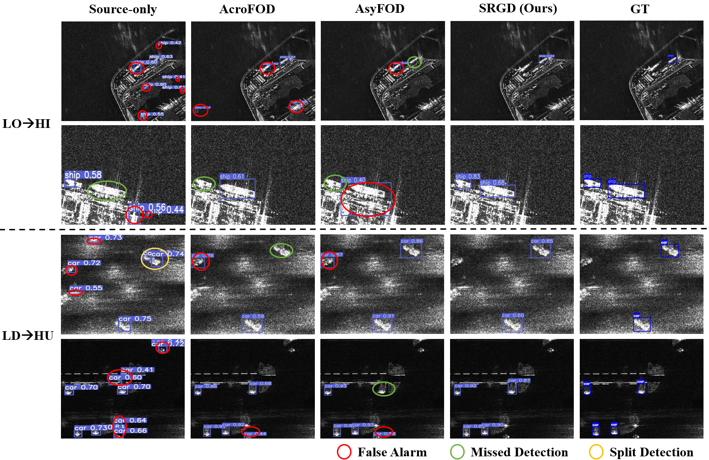

# Few-Shot SAR Object Detection Under Scene–Resolution Shifts

## 0. Table of Contents
- [1. Introduction](#1-introduction)
- [2. Contribution](#2-contribution)
- [3. Framework](#3-framework)
- [4. Scene-Resolution Shift Benchmark](#4-scene-resolution-shift-benchmark)
- [5. Experiments](#5-experiments)
- [6. Getting Started](#6-getting-started)

## 1. Introduction
The official implementation of paper "Few-Shot SAR Object Detection Under Scene–Resolution Shifts".

## 2. Contribution
- We identify and formally define the Scene–Resolution Domain Shift (SR-Shift) as a critical challenge in generalizable SAR object detection, which has been largely overlooked in prior research. We introduce SR-Bench, the first benchmark to evaluate the few-shot SR-Shift problem, providing a comprehensive evaluation tool for SR-Shift-related challenges.
- We propose the Scene–Resolution Generalization Detector (SRGD), a novel framework that addresses the SR-Shift challenge by jointly handling scene and resolution variations. Unlike existing methods that treat these factors separately, SRGD decouples scene semantics from target features using a vision-language model, ensuring robust generalization with few-shot samples. Additionally, it selectively aligns low-frequency components of decoupled target features across resolutions, enabling cross-resolution generalization. This integrated approach provides a unique solution to SR-Shift, filling a gap that current methods do not address effectively.
- Experimental results demonstrate that SRGD outperforms existing methods on SR-Bench, achieving state-of-the-art performance and showcasing flexibility for both horizontal and oriented object detectors.

## 3. Framework

## 4. Scene-Resolution Shift Benchmark

## 5. Experiments

## 6. Getting Started

